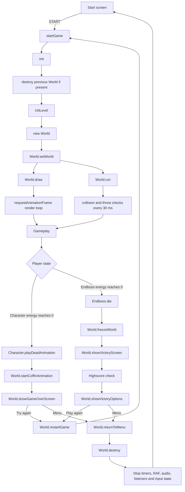

# El Pollo Loco

El Pollo Loco is a browser-based jump-and-run game built with Vanilla JavaScript, HTML, CSS, and the Canvas API.

The player controls Pepe through a scrolling desert level, collects coins and salsa bottles, defeats chickens, and finally fights the end boss. The game supports desktop keyboard controls and responsive touch controls for mobile landscape mode.

## Current gameplay flow

The following diagram shows the current lifecycle from the start screen to either Victory or Game Over.

## Game startup

The start button calls `startGame()` in `script.js`.

`startGame()`:

- hides the start screen;
- shows the game canvas;
- calls `init()`;
- enables mobile controls when applicable;
- starts the background music;
- binds the global canvas sound handler.

`init()` in `js/game.js` creates a clean game instance:

1. Retrieves the canvas.
2. Calls `world.destroy()` if an older World still exists.
3. Calls `initLevel()`.
4. Creates a new `World(canvas, keyboard)`.
5. Stores the active instance in `window.world`.

This guarantees that a restart does not leave an old World active in the background.

## Level initialization

`initLevel()` in `levels/level1.js` builds the current level from:

- `Chicken` enemies;
- `LittleChicken` enemies;
- one `Endboss`;
- collectible salsa bottles;
- collectible coins;
- moving clouds;
- layered background objects.

The level data is passed to the `level` class and then used by `World`.

## Main World responsibilities

The `World` class currently coordinates most gameplay systems.

Important responsibilities include:

| Function | Responsibility |
| --- | --- |
| `setWorld()` | Links the Character and enemies to the active World instance. |
| `draw()` | Renders background, HUD, collectibles, Character, enemies, bottles, and end-state screens. |
| `run()` | Starts recurring collision and throw checks. |
| `checkCollisions()` | Handles Character/enemy, Character/collectible, and bottle/enemy collisions. |
| `checkThrowObjects()` | Creates thrown bottles and applies the throw cooldown. |
| `collectBottle()` | Removes a collected bottle, updates the bottle bar, and awards score. |
| `collectCoin()` | Removes a collected coin, updates the coin bar, and awards score. |
| `addScore()` | Updates the game score and draws the temporary score effect. |
| `showVictoryScreen()` | Stops gameplay, calculates the Victory bonus, and starts the Victory flow. |
| `endGame()` | Stops combat and starts the Game Over sequence. |
| `restartGame()` | Resets end-state values and starts a completely fresh game instance. |
| `returnToMenu()` | Destroys the active World and restores the start menu without reloading the page. |
| `destroy()` | Cancels World timers, RAF rendering, listeners, overlays, and global gameplay processes. |

## Rendering and gameplay processes

The game uses two main execution paths.

### Rendering

`World.draw()` uses `requestAnimationFrame()` and continuously renders:

- layered backgrounds;
- clouds;
- status bars;
- score;
- collectibles;
- Pepe;
- enemies;
- thrown bottles;
- Game Over or Victory content when active.

The animation frame ID is stored in `animationFrameId` and cancelled by `World.destroy()`.

### Gameplay checks

`World.run()` starts a registered interval that repeatedly calls:

- `checkCollisions()`;
- `checkThrowObjects()`.

Gameplay intervals are registered through `SoundHub` so they can be stopped centrally when gameplay ends.

World-specific delayed actions use:

- `setManagedTimeout()`;
- `setManagedInterval()`;
- `clearManagedTimeouts()`;
- `clearManagedIntervals()`.

This prevents callbacks from an old game instance from continuing after Restart or Return to Menu.

## Player controls

### Desktop

| Input | Action |
| --- | --- |
| Left Arrow | Move left |
| Right Arrow | Move right |
| Space | Jump |
| Shift | Throw salsa bottle |
| Up Arrow | Throw salsa bottle |
| Sound icon | Toggle mute |

Keyboard state is stored in a `Keyboard` instance and read by the Character and World.

### Mobile landscape

The responsive touch controls use Pointer Events and support simultaneous input.

Left side:

- `LEFT`
- `JUMP`

Right side:

- `RIGHT`
- `THROW`

The mobile control state is mapped onto the same Keyboard flags used by desktop input.

Short transfer windows make it possible to slide between movement and action buttons without immediately interrupting movement.

## Character control

The `Character` class handles Pepe's movement and animation states.

Important behavior:

- `animate()` reads the active keyboard state and controls movement, jumping, idle states, hurt animation, and death detection;
- `applyGravity()` controls vertical movement;
- `playThrowAnimation()` plays the throw sequence;
- `playDeadAnimation()` plays the death sequence and schedules the coffin transition;
- `snapToGround()` stabilizes Pepe after vertical movement.

If Pepe's energy reaches zero, the Character starts the death animation and transfers control to the Game Over flow.

## Collision and scoring flow

`World.checkCollisions()` coordinates the central gameplay interactions.

Examples:

- jumping onto a normal chicken defeats it;
- touching a living enemy damages Pepe;
- collecting bottles increases bottle inventory;
- collecting coins increases the coin counter;
- thrown bottles can defeat chickens;
- thrown bottles damage the end boss;
- jumping onto the end boss damages it and bounces Pepe away.

The World updates the corresponding status bars and score after these events.

## Game Over flow

The Game Over path currently follows this sequence:

1. Pepe reaches zero energy.
2. `Character.playDeadAnimation()` starts.
3. `World.startCoffinAnimation()` runs the coffin sequence.
4. `World.showGameOverScreen()` displays the end-state controls.
5. The player chooses:
   - **Try again** → `restartGame()`;
   - **Menu** → `returnToMenu()`.

`restartGame()` starts a new World without using `location.reload()`.

`returnToMenu()` performs a full cleanup and returns to the start screen.

## Victory flow

The Victory path starts when the end boss has no remaining energy.

1. `Endboss.die()` stops boss activity and plays the death animation.
2. The World is frozen.
3. 150 points are added for defeating the boss.
4. `World.showVictoryScreen()` calculates the final bonus.
5. The highscore is evaluated.
6. A qualifying score opens the player-name dialog.
7. The Victory options are displayed.
8. The player chooses:
   - **Play again** → `restartGame()`;
   - **Menu** → `returnToMenu()`.

The current highscore implementation stores the top 10 entries in `localStorage`.

## Victory bonus

The final Victory bonus is calculated from remaining resources:

- collected bottles × 3;
- collected coins × 15;
- remaining Character energy × 0.7, rounded.

The resulting bonus is added before the highscore check.

## Highscore flow

The current highscore data is stored in browser `localStorage`.

Important functions:

| Function | Responsibility |
| --- | --- |
| `saveHighScoreEntry()` | Checks whether the current score qualifies for the current Top 10. |
| `openHighscoreNameDialog()` | Opens the responsive player-name dialog. |
| `submitHighscoreName()` | Validates the player name before saving. |
| `storeHighscore()` | Sorts and stores the highscore list. |
| `showHighscoreSavedOverlay()` | Shows the save confirmation dialog. |
| `showVictoryOptions()` | Displays the final highscore table and Victory actions. |

The most recently stored entry can be highlighted in the highscore display.

## Game lifecycle cleanup

A major design requirement is that Restart and Return to Menu work without a browser reload.

`World.destroy()` currently performs the main cleanup:

- sets `isRunning = false`;
- stops globally registered gameplay intervals;
- stops active game audio;
- clears World-managed timeouts;
- clears World-managed intervals;
- removes temporary highscore messages;
- cancels the active `requestAnimationFrame`;
- removes Game Over and Victory canvas listeners;
- disables score blinking;
- detaches Victory click handling.

`returnToMenu()` additionally:

- stops boss-specific processes;
- resets keyboard state;
- resets mobile touch state;
- removes gameplay-only mobile-control classes;
- removes the global canvas sound handler;
- hides the canvas;
- restores the start screen;
- clears `window.world`.

This ensures that returning to the menu leaves no active game instance behind.

## Audio management

`SoundHub` centralizes:

- background music;
- sound effects;
- mute state;
- persisted volume settings;
- gameplay interval registration;
- gameplay timeout registration;
- global audio cleanup;
- snoring audio;
- boss audio cleanup.

The mute setting and volume settings are stored in `localStorage`.

## Responsive behavior

The internal game canvas remains at its fixed logical game size while CSS scales the visible stage proportionally.

The responsive implementation includes:

- proportional 3:2 stage scaling;
- canvas pointer-coordinate conversion through `getCanvasCoordinates()`;
- landscape touch controls;
- portrait rotation overlay;
- responsive start menu;
- responsive settings and highscore overlays;
- Highscore name and confirmation dialogs sized relative to the viewport;
- adaptive touch-control placement.

## Important source files

| File | Main responsibility |
| --- | --- |
| `index.html` | Static page structure and overlays |
| `style.css` | Layout, responsive UI, overlays, and touch controls |
| `script.js` | Menu UI, start flow, settings, orientation, highscore UI |
| `js/game.js` | Game initialization, keyboard input, mobile input |
| `js/models-classes/world.class.js` | Main gameplay orchestration and lifecycle |
| `js/models-classes/character.class.js` | Pepe movement and animation |
| `js/models-classes/endboss.class.js` | End boss behavior and death flow |
| `js/models-classes/chicken.class.js` | Normal chicken enemy |
| `js/models-classes/little-chicken.class.js` | Small chicken enemy |
| `js/models-classes/throwable-objects.class.js` | Collectible and thrown salsa bottles |
| `js/models-classes/coin.class.js` | Collectible coin behavior |
| `soundhub.js` | Audio and shared gameplay-process management |
| `levels/level1.js` | Current level composition |

## Current project status

The current version includes:

- responsive desktop and mobile-landscape gameplay;
- keyboard and multi-touch controls;
- responsive menu and overlay system;
- audio controls with persistent mute and volume settings;
- Game Over and Victory flows;
- restart without page reload;
- clean Return-to-Menu lifecycle;
- local highscore storage;
- responsive highscore dialogs;
- controlled timer, interval, listener, and RAF cleanup.

Further level expansion is being planned separately so that difficulty progression, enemy development, highscore capacity, and level-transition behavior can be defined before implementation.
