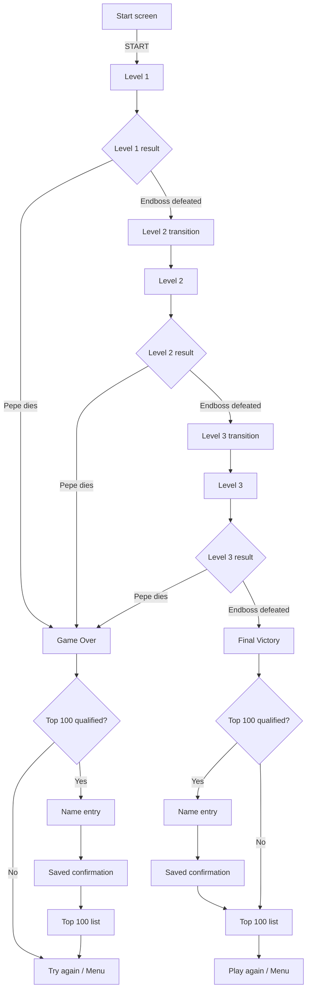

# El Pollo Loco

El Pollo Loco is a browser-based jump-and-run game built with Vanilla JavaScript, HTML, CSS, and the Canvas API.

The player controls Pepe through three increasingly demanding desert levels, collects coins and salsa bottles, defeats normal and small chickens, and fights an Endboss at the end of each level. The game supports desktop keyboard controls, responsive touch controls in mobile landscape mode, audio settings, pause/resume, Game Over, level transitions, Victory, and local Top-100 highscore handling.

## Table of contents

- [Technology](#technology)
- [Live demo](#live-demo)
- [Current gameplay flow](#current-gameplay-flow)
- [Three-level configuration](#three-level-configuration)
- [Level creation](#level-creation)
- [Level progression](#level-progression)
- [Bottle and coin HUD](#bottle-and-coin-hud)
- [Player movement boundaries](#player-movement-boundaries)
- [Chicken movement](#chicken-movement)
- [Airborne stomp combo](#airborne-stomp-combo)
- [Chicken Scatter reaction](#chicken-scatter-reaction)
- [Endboss movement and combat](#endboss-movement-and-combat)
- [Ground bottle pickup collision](#ground-bottle-pickup-collision)
- [Pause system](#pause-system)
- [Player controls](#player-controls)
- [Game Over flow](#game-over-flow)
- [Final Victory flow](#final-victory-flow)
- [Current scoring state](#current-scoring-state)
- [World architecture](#world-architecture)
- [Audio management](#audio-management)
- [Responsive behavior](#responsive-behavior)
- [Typography](#typography)
- [Privacy and browser storage](#privacy-and-browser-storage)
- [Project context and credits](#project-context-and-credits)
- [Responsive release targets](#responsive-release-targets)
- [Important source files](#important-source-files)
- [Release status](#release-status)
- [Release packaging note](#release-packaging-note)
- [Developer Akademie release checklist](#developer-akademie-release-checklist)

## Technology

- HTML5
- CSS3
- Vanilla JavaScript
- Canvas 2D API
- DOM APIs and Pointer Events
- browser `localStorage`
- native HTML audio

The project does not use a frontend framework, backend API, analytics service, advertising service, or third-party runtime script.

## Live demo

The production deployment is currently being prepared for:

`https://el-pollo-loco.juergen-malinowski.de`

The URL will be treated as the final Live Demo only after the All-Inkl deployment, HTTPS configuration, and live regression tests have been completed.

## Current gameplay flow

The current release candidate contains a complete three-level progression flow.



Pepe's death has priority over boss completion. If Pepe and the Endboss die during the same combat sequence, the run always follows the Game Over path and cannot open the next-level dialog or Victory flow.

## Three-level configuration

All level-specific balancing values are centralized in `levels/level-config.js`.

| Value | Level 1 | Level 2 | Level 3 |
| --- | ---: | ---: | ---: |
| World width | 2000 px | 2720 px | 3440 px |
| Normal chickens | 7 | 10 | 13 |
| Small chickens | 5 | 8 | 11 |
| Ground bottles | 9 | 11 | 13 |
| New start bottles | 6 | 5 | 4 |
| Coins | 16 | 22 | 28 |
| Pepe energy | 300 | 350 | 400 |
| Endboss energy | 300 | 400 | 500 |
| Endboss movement speed | 5.0 | 5.5 | 6.0 |
| Endboss charge speed | 20 | 22 | 24 |
| Endboss charge distance | 600 px | 650 px | 700 px |
| Endboss charge damage | 100 | 100 | 100 |
| Endboss charge cooldown | 7000 ms | 6000 ms | 5000 ms |
| Endboss hit cooldown | 400 ms | 350 ms | 300 ms |

Normal and small chicken movement speeds also increase through level-specific random speed ranges.

The background is extended dynamically to the configured end of the active level.

## Level creation

`levels/level1.js` is currently the shared level factory despite its historic filename.

For every configured level it creates:

- the configured number of normal chickens;
- the configured number of small chickens;
- one Endboss;
- the configured number of ground bottles;
- the configured number of coins;
- clouds;
- layered desert backgrounds.

Normal enemies are distributed across separate horizontal spawn slots. Enemy types are shuffled, while each slot receives a randomized position inside its own area. This avoids large accidental enemy clusters at level start.

## Level progression

Defeating the Endboss in Level 1 or Level 2:

1. stops active gameplay;
2. stores the remaining bottle inventory;
3. calculates the current level-end bonus;
4. freezes the finished World;
5. opens the next-level dialog;
6. creates a fresh World for the following level.

The accumulated score continues across levels.

Unused bottles are carried into the next level and are added to that level's configured new start bottles.

Example:

```text
remaining bottles from Level 1
+ Level 2 start bottles
= Level 2 starting inventory
```

There is no artificial global bottle cap.

## Bottle and coin HUD

Bottle and coin resources use custom twenty-segment HUD bars.

Each segment represents five percent of the active level resource range.

The exact numeric counts remain visible beside the bars.

### Bottle bar

The fixed maximum for the active level is calculated from:

```text
carried bottles
+ new start bottles
+ collectible ground bottles
```

### Coin bar

The coin bar is scaled against the configured number of coins in the current level.

Coin collection starts from zero again when a new World is created for the next level.

Health and Endboss energy continue to use the image-based status bars, but their exact remaining energy values are now displayed numerically beside the bars.

The combat HUD keeps the order Health, Endboss, Bottles, Coins so the most important fight information remains grouped together.

## Player movement boundaries

Pepe may move across the complete playable world while remaining fully visible.

```text
left boundary  = 0
right boundary = levelEndX - Pepe.width
```

The camera is clamped to the playable level and no longer reveals technical background space beyond the configured world end.

## Chicken movement

Living chickens remain inside the current level until they are defeated or the level ends.

When a chicken reaches either level boundary:

- it turns around;
- it stays completely inside the level;
- it receives a new random movement speed from the current level configuration.

This applies to both normal and small chickens.

## Airborne stomp combo

Consecutive Chicken stomps during the same airborne sequence can build an unlimited stomp combo.

The first stomp awards only the normal enemy score. Every additional stomp before Pepe touches the ground adds an exponentially increasing combo bonus:

```text
second stomp  +20
third stomp   +40
fourth stomp  +80
fifth stomp   +160
...
```

The configured combo multiplier is `2`.

The normal Chicken or Little Chicken stomp score is always added in addition to the combo bonus.

The combo resets when Pepe returns to the ground, dies, restarts, or enters the next level. Taking damage alone does not reset the combo.

Bottle kills and Endboss stomps are excluded from this combo system.

## Chicken Scatter reaction

A dense Chicken group can react to the beginning of a stomp combo by scattering.

The reaction is triggered when the first stomp finds at least five living normal or small chickens within a 400-pixel radius.

The stomped Chicken counts toward the density check but does not flee itself.

Scattering chickens:

- choose randomized escape distances based on their own sprite width;
- may reverse direction before fleeing;
- receive randomized movement speeds;
- have a chance to perform a panic hop;
- remain inside the playable level;
- cannot damage Pepe while they are actively scattering;
- resume normal movement after the scatter movement ends.

The complete group reaction uses one dedicated scatter sound effect.

## Endboss movement and combat

The Endboss can also move across the complete playable level while remaining fully visible.

```text
left boundary  = 0
right boundary = levelEndX - Endboss.width
```

Normal body contact and the charge attack intentionally behave differently.

### Normal Endboss contact

Normal contact causes continuous contact damage only while Pepe has ground contact and overlaps the boss.

As soon as Pepe is airborne, normal body overlap no longer causes this continuous contact damage. This allows a deliberate jump attack from close range without continuously losing health during the ascent.

Normal contact does not automatically knock Pepe away, so the player can still move through the boss and reach the other side of the arena.

### Charge attack

Charge pressure increases across the three levels through speed and range, while charge damage remains fixed at 100.

A successful charge:

- causes 100 damage;
- launches Pepe vertically;
- applies a horizontal boss knockback;
- marks the movement as boss-caused so it cannot be interpreted as a stomp attack.

Before Pepe is moved, the complete horizontal knockback target is calculated.

The preferred direction is away from the boss. If that target would leave the playable level, the opposite direction is selected before any movement occurs.

This prevents corner traps without producing a visible double knockback.

### Boss stomp and recovery rules

A boss-caused knockback cannot become an accidental stomp when Pepe falls back down.

A genuine player-initiated jump remains a valid boss attack even while Pepe is inside his Hurt animation period. Boss-facing direction is irrelevant to stomp damage.

After an accepted hit, the Endboss enters a short level-specific recovery period:

- Level 1: 400 ms;
- Level 2: 350 ms;
- Level 3: 300 ms.

During this shared recovery window, the Endboss cannot receive another hit and cannot damage Pepe through normal contact or charge collision.

### Pre-fight bottle activation

Pepe can still attack the visible Endboss with long-range bottle throws before crossing the normal proximity trigger.

Accepted bottle hits are counted while the boss is still inactive. The third accepted pre-fight bottle hit starts the same alert and attack sequence that would normally be triggered by reaching the configured alert position.

### Boss-fight Special Jump

Pepe has a dedicated escape move during an active Endboss fight.

Two separate Jump inputs within 500 ms trigger the Special Jump. The same input timing works with desktop keyboard input, touch controls, and pen input through Pointer Events.

The horizontal range is derived directly from the active boss charge distance:

```text
Special Jump distance = boss charge distance + 2 × Pepe sprite width
```

With Pepe's current 150-pixel sprite width this results in:

| Level | Special Jump distance |
| --- | ---: |
| Level 1 | 900 px |
| Level 2 | 950 px |
| Level 3 | 1000 px |

The Special Jump always starts away from the Endboss.

If the flight reaches a level boundary, Pepe reflects from the boundary and continues across the arena without increasing the original total travel budget. The landing calculation aims to keep at least 100 pixels of free space between Pepe's and the Endboss's collision areas.

The visual flight uses a long curved trajectory. Pepe rotates head-first along the rising arc, returns upright near the apex, follows the descending arc feet-first, and straightens again before landing.

Enemy collisions are ignored during the Special Jump itself. The move therefore cannot damage the Endboss or chickens while Pepe is travelling through the air. If the final landing position happens to overlap a living normal Chicken or Little Chicken, that landing is resolved as a regular stomp hit.

The move uses a dedicated Special Jump sound effect.

## Ground bottle pickup collision

Ground bottles use a dedicated pickup collision test.

Pepe's configured collision offsets are used instead of the full 150-pixel sprite width, and both horizontal and vertical overlap are required.

This prevents bottles from being collected before Pepe visually reaches them.

Thrown-bottle projectile collision remains separate from pickup collision.

## Pause system

Active gameplay can be paused and resumed without rebuilding the World.

### Controls

| Input | Action |
| --- | --- |
| P | Pause / Resume |
| PAUSED - RESUME HUD button | Resume |

While paused:

- Pepe movement stops;
- gravity stops;
- chickens stop moving and animating;
- coin animation stops;
- clouds stop;
- thrown bottles stop;
- collision checks stop;
- Endboss movement and attacks stop;
- active game audio is paused at its current playback position;
- held gameplay input is cleared.

The render loop remains active so the pause indicator stays visible and clickable.

The visible pause button is positioned below the level indicator.

Pause is disabled once terminal Boss-defeat, Game Over, or Victory handling has started.

## Player controls

### Desktop

| Input | Action |
| --- | --- |
| Left Arrow | Move left |
| Right Arrow | Move right |
| Space | Jump |
| Space twice within 500 ms | Special Jump during active Boss fight |
| Shift | Throw salsa bottle |
| Up Arrow | Throw salsa bottle |
| P | Pause / Resume |
| Sound icon | Toggle mute |

The same pause instruction is shown in the Game Control menu and in the in-game control hints.

### Mobile landscape

The responsive touch controls use Pointer Events and support simultaneous input.

Both sides use the same vertical control order:

- movement direction at the top;
- `JUMP` in the middle;
- `THROW` at the bottom.

The left column starts with `LEFT`, while the right column starts with `RIGHT`. This allows movement to stay under one thumb while the other thumb can independently jump or throw.

Both JUMP buttons map to the same Space input and both THROW buttons map to the same Shift input. Releasing one duplicate action button does not cancel the action while its counterpart is still held.

Two quick JUMP presses within 500 ms use the same Special Jump detection as the desktop keyboard, including presses that alternate between the left and right JUMP buttons.

Short transfer windows continue to allow the player to slide between movement and action controls without immediately interrupting movement.

The left and right direction controls use symmetric inline SVG arrows so their appearance does not depend on device-specific Unicode or emoji font rendering.

## Game Over flow

When Pepe reaches zero energy:

1. Pepe is immediately marked as defeated;
2. the death animation starts;
3. boss/level-completion paths are blocked;
4. the coffin sequence is shown;
5. the Game Over screen opens;
6. the current score is checked against the stored Top 100.

If the score qualifies, the shared highscore name dialog is opened. After saving, a confirmation is shown and the shared Top-100 list opens with the exact new placement highlighted and scrolled into view.

If name entry is cancelled, the score is not stored and the normal Game Over screen remains active.

If the score does not qualify, the normal Game Over actions remain available directly:

- **Try again**
- **Menu**

Restart is performed without `location.reload()`.

## Final Victory flow

Defeating the Level 3 Endboss starts the final Victory flow.

The current implementation:

- stops gameplay and audio;
- adds the current end-of-level bonus;
- evaluates the score for the local Top 100;
- opens the shared player-name dialog for a qualifying score;
- stores qualifying entries in `localStorage`;
- opens the same scrollable Top-100 DOM view used by the start menu and Game Over flow;
- highlights the exact newly stored entry by its unique ID;
- automatically scrolls the list to the new placement;
- continues to the Top-100 view without storing when name entry is cancelled;
- offers Play again and Menu actions directly below the Victory highscore list.

The Top-100 qualification rule is strict when the table is full: a new score must be higher than the current rank-100 score.

## Current scoring state

All current combat, collectible, throw, boss, and level-end score values are centralized inside each level configuration.

| Score event | Level 1 | Level 2 | Level 3 |
| --- | ---: | ---: | ---: |
| Chicken stomp | 15 | 20 | 25 |
| Little Chicken stomp | 20 | 25 | 30 |
| Chicken bottle kill | 25 | 30 | 35 |
| Little Chicken bottle kill | 40 | 50 | 60 |
| Coin pickup | 5 | 8 | 12 |
| Bottle pickup | 2 | 5 | 8 |
| Bottle throw | 3 | 5 | 8 |
| Endboss stomp | 75 | 100 | 125 |
| Endboss bottle hit | 40 | 50 | 60 |
| Successful boss charge dodge | 150 | 220 | 300 |
| Endboss kill | 300 | 500 | 1000 |

The end-of-level bonus is also level-specific:

| Bonus multiplier | Level 1 | Level 2 | Level 3 |
| --- | ---: | ---: | ---: |
| Remaining bottle | ×5 | ×10 | ×25 |
| Collected coin | ×15 | ×20 | ×30 |
| Remaining Pepe energy | ×0.7 | ×0.8 | ×1.2 |

The accumulated score continues across all three levels.

## World architecture

`World` coordinates focused subsystems rather than owning every gameplay responsibility directly.

### WorldCollisionManager

Handles:

- Character versus Chicken and Little Chicken;
- Character versus Endboss;
- stomp detection;
- continuous enemy-contact damage;
- boss knockback resolution;
- bottle pickups;
- coin pickups;
- thrown-bottle hits;
- delayed removal of defeated normal enemies.

### WorldStompComboManager

Coordinates:

- airborne stomp-combo progression;
- exponential combo bonuses;
- combo reset rules;
- dense Chicken-group detection;
- randomized Scatter movement;
- optional panic hops;
- Scatter sound triggering.

### WorldSpecialJumpManager

Coordinates:

- double-Jump input timing;
- active-boss eligibility;
- level-scaled escape distance;
- boss-relative jump direction;
- boundary reflection;
- safe landing distance;
- curved flight movement;
- Special Jump rotation;
- final Chicken landing checks.

### WorldHudRenderer

Handles:

- health, bottle, coin, and boss status displays;
- twenty-segment bottle and coin bars;
- numeric health, boss-energy, bottle, and coin values;
- score rendering;
- active level label;
- responsive game-control hints;
- sound icon;
- pause indicator and Resume hit area;
- responsive mobile HUD positioning.

### WorldRenderer

Handles the frame rendering path:

- background layers;
- clouds;
- collectibles;
- Pepe;
- enemies;
- thrown bottles;
- HUD;
- coffin;
- Victory and Game Over rendering;
- sprite mirroring;
- Special Jump sprite rotation;
- `requestAnimationFrame()` scheduling.

### WorldGameStateManager

Coordinates:

- Pepe-death priority;
- coffin sequence;
- Game Over;
- next-level versus final-Victory routing;
- restart;
- return to menu;
- current level-end bonus.

### WorldLevelManager

Coordinates:

- background extension;
- successful level completion;
- bottle carryover;
- level transition dialogs.

### WorldPauseManager

Coordinates:

- pause/resume state;
- held-key reset;
- active audio pausing;
- audio resume.

### WorldProcessManager

Coordinates:

- lifecycle cleanup;
- boss cleanup;
- input reset;
- audio shutdown;
- object freezing;
- canvas listener cleanup;
- start-screen restoration.

### WorldHighscoreManager

Coordinates:

- Top-100 qualification;
- highscore data loading;
- newest-entry tracking;
- Game Over and Victory highscore routing;
- Victory audio cleanup;
- temporary highscore messages.

### Shared DOM highscore system

`js/highscore-system.js` coordinates:

- versioned highscore storage initialization;
- one-time removal of obsolete pre-Top-100 test data;
- storage of up to 100 entries;
- unique entry IDs and creation timestamps;
- deterministic ranking;
- shared menu, Game Over, and Victory rendering;
- exact newest-entry highlighting;
- automatic scrolling to a new placement;
- shared name entry and save confirmation;
- context-specific Close, Play again, and Menu actions.

The previous Canvas-specific Victory highscore implementation has been removed in favor of the shared DOM presentation.

## Audio management

`SoundHub` centralizes:

- background music;
- sound effects;
- mute state;
- persisted volume settings;
- gameplay interval registration;
- gameplay timeout registration;
- global audio cleanup;
- snoring audio;
- boss audio cleanup;
- Scatter and Special Jump effects.

Mute and volume settings are stored in `localStorage`.

Pause temporarily pauses active playback without treating the game as muted.

## Responsive behavior

The internal game canvas keeps its fixed logical dimensions while CSS scales the visible stage proportionally.

The current responsive implementation includes:

- proportional 3:2 stage scaling;
- canvas pointer-coordinate conversion;
- landscape touch controls;
- portrait orientation overlay;
- responsive start menu;
- responsive settings, control, legal, and highscore overlays;
- adaptive HUD positioning;
- responsive score and control hints;
- adaptive sound-icon placement;
- touch controls that can move inside or outside the stage depending on available viewport space.

## Typography

The game uses the **Smokum** display font.

Smokum is self-hosted from:

`assets/fonts/Smokum-Regular.ttf`

The corresponding Apache License 2.0 text is included in:

`assets/fonts/LICENSE-Smokum.txt`

The game does not request Google Fonts or another external font service at runtime.

## Privacy and browser storage

The game runs entirely in the browser and does not require a user account or backend connection.

The current implementation:

- does not set cookies;
- does not use analytics or advertising;
- does not load third-party runtime scripts;
- does not call external APIs during gameplay;
- stores audio preferences locally in the browser;
- stores qualifying Top-100 highscore entries locally in the browser;
- does not require a real name for highscore entries.

The highscore storage contains the selected player name or pseudonym, score, creation timestamp, and a local entry ID.

Legal and privacy information is available both from the game menu and as direct pages:

- `info.html` – Legal Notice, project notices, credits, graphics, audio, and font sources;
- `privacy.html` – Privacy Policy for the public Live Demo.

## Project context and credits

El Pollo Loco was developed as a training project in the Developer Akademie curriculum and is presented as a non-commercial portfolio project.

Selected base graphics and project assets were provided by Developer Akademie as part of the training project and are used for the non-commercial portfolio presentation and Live Demo.

Additional external graphics, music, and sound effects are credited individually in `info.html`. Original audio recordings created specifically for this project are identified there separately.

## Responsive release targets

The game is designed for desktop and mobile landscape play. Portrait mobile orientation shows a rotation notice instead of the active game controls.

Reference viewport sizes used throughout responsive regression testing include:

- `896x414`
- `720x480`
- `667x375`
- `568x320`

The mobile HUD keeps Health, Endboss, Bottle, and Coin information inside the visible Canvas, including their numeric values. Touch controls remain outside or overlap the stage depending on the available viewport geometry.

## Important source files

| File | Main responsibility |
| --- | --- |
| `index.html` | Static page structure, overlays, and script loading |
| `variables.css` | Shared color variables |
| `info.html` | Legal Notice, project context, credits, graphics, audio, and font attribution |
| `privacy.html` | Privacy Policy for the public Live Demo |
| `assets/fonts/Smokum-Regular.ttf` | Locally hosted Smokum game font |
| `assets/fonts/LICENSE-Smokum.txt` | Apache License 2.0 text for Smokum |
| `style.css` | Global layout, game stage, touch controls, typography, and start screen |
| `overlays.css` | Shared overlay sizing, Top 100 display, Legal Notice, and Canvas initial state |
| `menu-overlays.css` | Audio, Help, and Game Control overlays |
| `highscore-overlays.css` | Highscore name-entry and confirmation overlays |
| `responsive.css` | Responsive Legal Notice, orientation UI, landscape controls, and low-height viewport rules |
| `js/responsive-ui.js` | Touch-control placement, viewport orientation handling, fullscreen rotation request, and responsive UI listeners |
| `script.js` | Start/menu UI, settings, general DOM overlays, and Canvas HUD click binding |
| `js/highscore-system.js` | Top-100 storage, shared highscore DOM, name entry, highlighting, and result actions |
| `soundhub.js` | Audio and shared gameplay-process management |
| `js/game.js` | Game initialization, level progression state, and keyboard input |
| `js/mobile-controls.js` | Symmetric touch controls, multi-pointer state, movement transfer windows, Jump, Throw, and Special Jump input |
| `levels/level-config.js` | Central three-level gameplay configuration |
| `levels/level1.js` | Shared configured level factory |
| `js/models-classes/world.class.js` | Main World initialization, state, resource orchestration, and manager delegation |
| `js/models-classes/world-collision-manager.class.js` | Collision, pickups, projectile hits, and boss knockback |
| `js/models-classes/world-stomp-combo-manager.class.js` | Stomp combos, Chicken Scatter behavior, and Scatter movement |
| `js/models-classes/world-special-jump-manager.class.js` | Boss-fight Special Jump timing, trajectory, edge reflection, and landing |
| `js/models-classes/world-status-hud-renderer.class.js` | Health, boss, bottle, coin, segmented resource bars, and numeric status values |
| `js/models-classes/world-pause-hud-renderer.class.js` | Desktop resume UI, mobile Canvas pause control, hit areas, and pause interaction |
| `js/models-classes/world-hud-renderer.class.js` | Score, control hints, sound, level indicator, shared mobile HUD geometry, and HUD interaction routing |
| `js/models-classes/world-renderer.class.js` | Scene, temporary gameplay feedback, object, and terminal-state rendering |
| `js/models-classes/world-game-state-manager.class.js` | Game Over, level completion, Victory, restart, and menu flow |
| `js/models-classes/world-level-manager.class.js` | Background extension and level transitions |
| `js/models-classes/world-pause-manager.class.js` | Pause/resume and paused-audio state |
| `js/models-classes/world-process-manager.class.js` | Cleanup, shutdown, freezing, and menu reset |
| `js/models-classes/world-highscore-manager.class.js` | Top-100 qualification and Game Over / Victory routing |
| `js/models-classes/character.class.js` | Pepe movement, animation, death, and world boundaries |
| `js/models-classes/endboss.class.js` | Endboss state, level configuration, damage state, and combat/lifecycle orchestration |
| `js/models-classes/endboss-combat-manager.class.js` | Endboss movement, alert sequence, pursuit, charge scheduling, charge movement, and charge damage |
| `js/models-classes/endboss-lifecycle-manager.class.js` | Endboss death sequence, terminal cleanup, timers, and boss-owned audio shutdown |
| `js/models-classes/chicken.class.js` | Normal chicken movement and boundary reversal |
| `js/models-classes/little-chicken.class.js` | Small chicken movement and boundary reversal |
| `js/models-classes/throwable-objects.class.js` | Ground and thrown salsa bottles |
| `js/models-classes/coin.class.js` | Coin behavior |

## Release status

The functional game and release-relevant UI work are complete for the current release candidate.

Verified areas include:

- complete Level 1 → Level 2 → Level 3 progression;
- Game Over, restart, level transition, and final Victory flows;
- desktop keyboard controls;
- responsive mobile landscape controls;
- Special Jump after Endboss activation;
- airborne stomp combo and Chicken Scatter behavior;
- responsive Health, Endboss, Bottle, and Coin HUD;
- pause/resume;
- mute and audio settings;
- shared Top-100 highscore flow;
- menu overlays on desktop and mobile;
- Legal Notice and Privacy Policy navigation;
- locally hosted Smokum font;
- removal of obsolete Zabars and Rye font assets;
- no known console errors in the final local regression pass.

The remaining release work is deployment-specific:

1. configure the All-Inkl production target and HTTPS;
2. define the exact production ZIP contents;
3. upload the production package to the FTP server;
4. verify all files and asset paths from the public HTTPS URL;
5. confirm that no external font, analytics, or unexpected network requests occur;
6. run the final desktop and mobile live-site regression tests;
7. replace the pending Live Demo status in this README with the verified public URL.

## Release packaging note

The Git repository and the production FTP package are intentionally not identical.

Before deployment, a dedicated ZIP package will be created containing only the files required by the browser at runtime. Repository metadata, GitHub-specific files, development-only material, and other non-runtime files will be excluded from the production upload.

The exact **include / exclude** list will be finalized immediately before the first All-Inkl deployment so the uploaded package matches the tested release state.

## Developer Akademie release checklist

The release candidate follows the project constraints used during final cleanup, including:

- no page reload for restart;
- no unnecessary console output;
- responsive landscape mobile gameplay;
- portrait rotation notice;
- local font delivery;
- functional favicon, buttons, and links;
- focused classes and manager responsibilities;
- professional English code documentation;
- approximately 14 commands maximum per function as a review guideline;
- source files targeted below 400 lines;
- complete gameplay and audio cleanup on terminal states;
- consistent English user-facing game text.

Further gameplay ideas and optional animation refinements are intentionally outside this release branch and should be implemented in separate feature branches after deployment.
