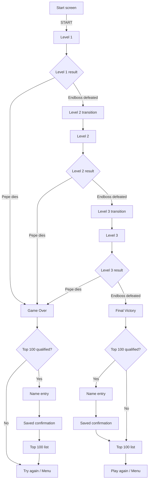
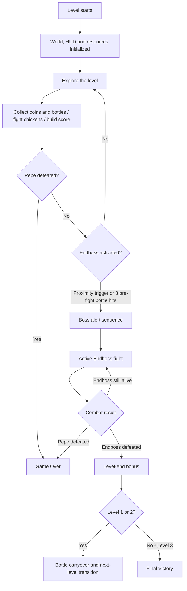

# El Pollo Loco

El Pollo Loco is a browser-based jump-and-run game built with Vanilla JavaScript, HTML, CSS, and the Canvas API.

It originated as a project during the frontend training program at Developer Akademie. Over time, the enjoyment of programming and game design led it to grow far beyond the original mandatory scope.

The player controls Pepe through three increasingly demanding desert levels, collects coins and salsa bottles, defeats normal and small chickens, and fights an Endboss at the end of each level. The game supports desktop keyboard controls, responsive touch controls in mobile landscape mode, audio settings, pause/resume, Game Over, level transitions, Victory, and local Top-100 highscore handling.

## Setup

The game has no build step and does not require package installation. It can be served directly from the repository root with any local static web server.

Clone the repository and enter the project directory:

```bash
git clone https://github.com/Juergen-Malinowski/modul-12-el-pollo-loco.git
cd modul-12-el-pollo-loco
```

Start a local server, for example with Python 3:

```bash
python -m http.server 5500
```

On Windows, the Python launcher can be used instead:

```powershell
py -m http.server 5500
```

Then open:

```text
http://localhost:5500/
```

Alternatively, the repository root can be served with a local development-server extension such as VS Code Live Server.

## Table of contents

- [Technology](#technology)
- [Live demo](#live-demo)
- [Gameplay flow](#gameplay-flow)
- [Three-level configuration](#three-level-configuration)
- [Level creation](#level-creation)
- [Level progression](#level-progression)
- [HUD and status bars](#hud-and-status-bars)
- [Player, Chicken and Endboss movement boundaries](#player-chicken-and-endboss-movement-boundaries)
- [Airborne stomp combo](#airborne-stomp-combo)
- [Chicken Scatter reaction](#chicken-scatter-reaction)
- [Endboss action and combat](#endboss-action-and-combat)
- [Ground bottle pickup collision](#ground-bottle-pickup-collision)
- [Pause system](#pause-system)
- [Player controls](#player-controls)
- [Game Over flow](#game-over-flow)
- [Final Victory flow](#final-victory-flow)
- [Scoring](#scoring)
- [World architecture](#world-architecture)
- [Audio management](#audio-management)
- [Startup loading and asset performance](#startup-loading-and-asset-performance)
- [Responsive behavior](#responsive-behavior)
- [Typography](#typography)
- [Privacy and browser storage](#privacy-and-browser-storage)
- [Project context and credits](#project-context-and-credits)
- [Developer Akademie compliance notes](#developer-akademie-compliance-notes)
- [Responsive release targets](#responsive-release-targets)
- [Important source files](#important-source-files)
- [Deployment and runtime delivery](#deployment-and-runtime-delivery)

## Technology

- HTML5
- CSS3
- Vanilla JavaScript
- Canvas 2D API
- DOM APIs and Pointer Events
- browser `localStorage`
- native HTML audio

The project does not use a frontend framework, backend API, analytics service, advertising service, or third-party runtime script.

## Live demo

The production Live Demo is deployed on ALL-INKL and available via HTTPS:

[https://el-pollo-loco.juergen-malinowski.de](https://el-pollo-loco.juergen-malinowski.de)

The public Live Demo reflects the finalized production build described in this README.

## Gameplay flow

The game contains a complete three-level progression flow.



Pepe's death has priority over boss completion. If Pepe and the Endboss die during the same combat sequence, the run always follows the Game Over path and cannot open the next-level dialog or Victory flow.

### Flow inside a level

Each level follows the same core structure while its size, enemy count, resources, scoring values, Pepe energy, and Endboss parameters increase through the three configurations.



## Three-level configuration

All level-specific balancing values are centralized in `levels/level-config.js`. Normal and small chicken movement speeds increase through level-specific random speed ranges, and the layered background is extended dynamically to the configured end of each level.

| Value | Level 1 | Level 2 | Level 3 |
| --- | ---: | ---: | ---: |
| World width | 2000 px | 2720 px | 3440 px |
| Normal chickens | 7 | 10 | 13 |
| Small chickens | 5 | 8 | 11 |
| Ground bottles | 9 | 11 | 13 |
| New start bottles | 6 | 5 | 4 |
| Coins | 16 | 22 | 28 |
| Pepe energy | 300 | 350 | 400 |
| Endboss energy | 300 | 400 | 500 |
| Endboss movement speed | 5.0 | 5.5 | 6.0 |
| Endboss charge speed | 20 | 22 | 24 |
| Endboss charge distance | 600 px | 650 px | 700 px |
| Endboss charge damage | 100 | 100 | 100 |
| Endboss charge cooldown | 7000 ms | 6000 ms | 5000 ms |
| Endboss hit cooldown | 400 ms | 350 ms | 300 ms |

## Level creation

The original Developer Akademie training project specified a single level, which explains the historical filename `levels/level1.js`. After the game was expanded to three levels with increasing difficulty, this file became the shared level factory for all three configurations.

For every configured level it creates:

- the configured number of normal chickens;
- the configured number of small chickens;
- one Endboss;
- the configured number of ground bottles;
- the configured number of coins;
- clouds;
- layered desert backgrounds.

Normal enemies are distributed across separate horizontal spawn slots. Enemy types are shuffled, while each slot receives a randomized position inside its own area. This avoids large accidental enemy clusters at level start.

## Level progression

Defeating the Endboss in Level 1 or Level 2:

1. stops active gameplay;
2. stores the remaining bottle inventory;
3. calculates the current level-end bonus;
4. freezes the finished World;
5. opens the next-level dialog;
6. creates a fresh World for the following level.

The accumulated score continues across levels.

Unused bottles are carried into the next level and are added to that level's configured new start bottles.

Example:

```text
remaining bottles from Level 1
+ Level 2 start bottles
= Level 2 starting inventory
```

There is no artificial global bottle cap.

## HUD and status bars

Bottle and coin resources use custom twenty-segment HUD bars. Each segment represents five percent of the active level resource range, while the exact numeric counts remain visible beside the bars.

Pepe's health and Endboss energy use image-based status bars with exact numeric values. Both start each level at their full configured values, while the Endboss's full energy increases from 300 in Level 1 to 400 in Level 2 and 500 in Level 3.

### Bottle bar

The fixed maximum for the active level is calculated from:

```text
carried bottles
+ new start bottles
+ collectible ground bottles
```

### Coin bar

The coin bar is scaled against the configured number of coins in the current level.

Coin collection starts from zero again when a new World is created for the next level.

## Player, Chicken and Endboss movement boundaries

Each level has fixed left and right world boundaries. Pepe can move freely in both directions at any time while remaining inside those boundaries, which allows backtracking instead of forcing the player into one-way progression.

Living normal and small chickens also remain inside the level; when they reach either boundary, they turn around and receive a new random movement speed from the active level configuration.

The Endboss waits at a fixed position near the end of the level until the boss-fight sequence begins. Once active, it can move freely within the level boundaries and pursues Pepe.

## Airborne stomp combo

Consecutive Chicken stomps during the same airborne sequence can build an unlimited stomp combo.

The first stomp awards only the normal enemy score. Every additional stomp before Pepe touches the ground adds an exponentially increasing combo bonus:

```text
second stomp  +20
third stomp   +40
fourth stomp  +80
fifth stomp   +160
...
```

The configured combo multiplier is `2`.

The normal Chicken or Little Chicken stomp score is always added in addition to the combo bonus.

The combo resets when Pepe returns to the ground, dies, restarts, or enters the next level. Taking damage alone does not reset the combo.

Bottle kills and Endboss stomps are excluded from this combo system.

This Stomp Combo is the key mechanic for exceptional high scores. Because enemy positions, movement speeds, Scatter behavior, and the resulting airborne chain vary during play, it cannot be reproduced as a fixed scoring pattern.

## Chicken Scatter reaction

The Scatter reaction is designed to break up very dense groups of chickens when Pepe begins an airborne Stomp Combo, making exceptionally long chains harder to sustain. Because each escaping chicken receives randomized movement behavior and other chickens continue moving through the level, Scatter can also occasionally create an even denser group later. These rare situations can reward skilled positioning with unusually long Stomp Combos.

On the first killing stomp of an airborne combo, Scatter is triggered when at least five normal or small chickens are within a 400-pixel radius around Pepe at that moment. The chicken hit by that stomp counts toward this density check.

Scattering chickens:

- choose randomized escape distances based on their own sprite width;
- may reverse direction before fleeing;
- receive randomized movement speeds;
- have a chance to perform a panic hop;
- remain inside the playable level;
- cannot damage Pepe while they are actively scattering;
- resume normal movement after the scatter movement ends.

The group reaction uses a dedicated Scatter sound effect and is visually accompanied by an animated Bat fly-by that dives across the scene with its own sound effect.

## Endboss action and combat

The Endboss begins each level at a fixed position near the far end of the world and waits for Pepe. When Pepe reaches the configured proximity trigger, the boss enters its alert sequence and the active fight begins.

Normal body contact and the Charge Attack intentionally behave differently.

### Normal Endboss contact

Normal contact causes continuous contact damage only while Pepe has ground contact and overlaps the boss.

As soon as Pepe is airborne, normal body overlap no longer causes this continuous contact damage. This allows a deliberate jump attack from close range without continuously losing health during the ascent.

Normal contact does not automatically knock Pepe away, so the player can still move through the boss and reach the other side of the arena. A successful Charge Attack is the Endboss contact that applies knockback and throws Pepe away from the boss.

### Charge attack

The Charge Attack is the Endboss's powerful and only direct attack; otherwise the boss damages Pepe through normal body contact. After the alert sequence, the Endboss starts pursuing Pepe, launches an immediate first charge, and then repeats charge attacks using the level-specific cooldown.

Charge pressure increases across the three levels through speed and range, while charge damage remains fixed at 100.

A successful charge:

- causes 100 damage;
- launches Pepe vertically;
- hurls Pepe horizontally away from the Endboss;
- marks Pepe's movement as boss-caused so the following descent cannot be interpreted as a player-initiated stomp attack.

Before Pepe is moved, the complete horizontal knockback target is calculated.

The preferred direction is away from the boss. If that target would leave the playable level, the opposite direction is selected before any movement occurs.

This prevents corner traps without producing a visible double knockback.

### Boss stomp and recovery rules

A boss-caused knockback is explicitly marked so Pepe's descent cannot be evaluated as a player-initiated stomp attack on the Endboss.

A genuine player-initiated jump remains a valid boss attack even while Pepe is inside his Hurt animation period. Boss-facing direction is irrelevant to stomp damage.

After an accepted hit, the Endboss enters a short level-specific recovery period:

- Level 1: 400 ms;
- Level 2: 350 ms;
- Level 3: 300 ms.

During this shared recovery window, the Endboss cannot receive another hit and Pepe cannot receive Endboss damage through normal contact or charge collision. The protection applies to both sides so the recovery timing does not create an unfair combat advantage.

### Pre-fight bottle activation

A jump can considerably increase Pepe's bottle-throwing range, which makes it possible in some situations to hit the Endboss before Pepe reaches the normal proximity trigger. This tactical advantage remains available, but it is limited.

Accepted bottle hits are counted while the boss is still inactive. The third accepted pre-fight bottle hit starts the same alert and attack sequence that would normally be triggered by reaching the configured alert position.

### Boss-fight Special Jump

Once the Endboss fight has been activated, the Special Jump is available throughout the level and is not tied to Pepe's distance from the boss. As long as Pepe is not already in a boss-caused knockback, it can be triggered even from the direct contact area with the Endboss, making it an escape move for close-range pressure.

Two separate Jump inputs within 500 ms trigger the Special Jump. The same input timing works with desktop keyboard input, touch controls, and pen input through Pointer Events.

The horizontal range is derived directly from the active boss charge distance:

```text
Special Jump distance = boss charge distance + 2 × Pepe sprite width
```

With Pepe's current 150-pixel sprite width this results in:

| Level | Special Jump distance |
| --- | ---: |
| Level 1 | 900 px |
| Level 2 | 950 px |
| Level 3 | 1000 px |

The Special Jump always starts away from the Endboss.

If the flight reaches a level boundary, Pepe reflects from the boundary and continues across the arena without increasing the original total travel budget. The landing calculation aims to keep at least 100 pixels of free space between Pepe's and the Endboss's collision areas.

The visual flight uses a long curved trajectory. Pepe rotates head-first along the rising arc, returns upright near the apex, follows the descending arc feet-first, and straightens again before landing.

Enemy collisions are ignored during the Special Jump itself. The move therefore cannot damage the Endboss or chickens while Pepe is travelling through the air. If the final landing position happens to overlap a living normal Chicken or Little Chicken, that landing is resolved as a regular stomp hit.

The move uses a dedicated Special Jump sound effect.

## Ground bottle pickup collision

Ground bottles use a dedicated pickup collision test.

Pepe's configured collision offsets are used instead of the full 150-pixel sprite width, and both horizontal and vertical overlap are required.

This prevents bottles from being collected before Pepe visually reaches them.

Thrown-bottle projectile collision remains separate from pickup collision.

## Pause system

Active gameplay can be paused and resumed without rebuilding the World.

### Controls

| Input | Action |
| --- | --- |
| P on desktop | Pause / Resume |
| Compact Canvas control on mobile | Pause / Resume |
| Desktop `PAUSED - RESUME` HUD action while paused | Resume |

While paused:

- Pepe movement stops;
- gravity stops;
- chickens stop moving and animating;
- coin animation stops;
- clouds stop;
- thrown bottles stop;
- collision checks stop;
- Endboss movement and attacks stop;
- active game audio is paused at its current playback position;
- held gameplay input is cleared.

The render loop remains active so the pause state and resume interaction remain visible. On desktop, active gameplay is paused and resumed with the `P` key; on mobile, a compact pause/resume control is placed near the sound control.

## Player controls

### Desktop

| Input | Action |
| --- | --- |
| Left Arrow | Move left |
| Right Arrow | Move right |
| Space | Jump |
| Space twice within 500 ms | Special Jump during active Boss fight |
| Shift | Throw salsa bottle |
| Up Arrow | Throw salsa bottle |
| P | Pause / Resume |
| Sound icon | Toggle mute |

The same pause instruction is shown in the Game Control menu and in the in-game control hints.

### Mobile landscape

The responsive touch controls use Pointer Events and support simultaneous input.

Both sides use the same vertical control order:

- movement direction at the top;
- `JUMP` in the middle;
- `THROW` at the bottom.

The left column starts with `LEFT`, while the right column starts with `RIGHT`. This allows movement to stay under one thumb while the other thumb can independently jump or throw.

Both JUMP buttons map to the same Space input and both THROW buttons map to the same Shift input. Releasing one duplicate action button does not cancel the action while its counterpart is still held.

Two quick JUMP presses within 500 ms use the same Special Jump detection as the desktop keyboard, including presses that alternate between the left and right JUMP buttons.

Short transfer windows continue to allow the player to slide between movement and action controls without immediately interrupting movement.

The left and right direction controls use symmetric inline SVG arrows so their appearance does not depend on device-specific Unicode or emoji font rendering.

## Game Over flow

When Pepe reaches zero energy:

1. Pepe is immediately marked as defeated;
2. the death animation starts;
3. boss/level-completion paths are blocked;
4. the coffin sequence is shown;
5. the Game Over screen opens;
6. the current score is checked against the stored Top 100.

If the score qualifies, the shared highscore name dialog is opened. After saving, a confirmation is shown and the shared Top-100 list opens with the exact new placement highlighted and scrolled into view.

If name entry is cancelled, the score is not stored and the normal Game Over screen remains active.

If the score does not qualify, the normal Game Over actions remain available directly:

- **Try again**
- **Menu**

Restart is performed without `location.reload()`.

## Final Victory flow

Defeating the Level 3 Endboss starts the final Victory flow.

The Victory flow:

- stops gameplay and audio;
- adds the current end-of-level bonus;
- evaluates the score for the local Top 100;
- opens the shared player-name dialog for a qualifying score;
- stores qualifying entries in `localStorage`;
- opens the same scrollable Top-100 DOM view used by the start menu and Game Over flow;
- highlights the exact newly stored entry by its unique ID;
- automatically scrolls the list to the new placement;
- continues to the Top-100 view without storing when name entry is cancelled;
- offers Play again and Menu actions directly below the Victory highscore list.

The Top-100 qualification rule is strict when the table is full: a new score must be higher than the current rank-100 score.

## Scoring

All combat, collectible, throw, boss, and level-end score values are centralized inside each level configuration.

| Score event | Level 1 | Level 2 | Level 3 |
| --- | ---: | ---: | ---: |
| Chicken stomp | 15 | 20 | 25 |
| Little Chicken stomp | 20 | 25 | 30 |
| Chicken bottle kill | 25 | 30 | 35 |
| Little Chicken bottle kill | 40 | 50 | 60 |
| Coin pickup | 5 | 8 | 12 |
| Bottle pickup | 2 | 5 | 8 |
| Bottle throw | 3 | 5 | 8 |
| Endboss stomp | 75 | 100 | 125 |
| Endboss bottle hit | 40 | 50 | 60 |
| Successful boss charge dodge | 150 | 220 | 300 |
| Endboss kill | 300 | 500 | 1000 |

Airborne Chicken stomps can add an exponential Stomp Combo bonus on top of the normal stomp score:

| Stomp in the same airborne chain | Additional combo score |
| --- | ---: |
| 1st stomp | +0 |
| 2nd stomp | +20 |
| 3rd stomp | +40 |
| 4th stomp | +80 |
| 5th stomp | +160 |
| 6th stomp | +320 |
| Each further stomp | previous combo bonus ×2 |

The regular Chicken or Little Chicken stomp score is always awarded in addition to this bonus. This exponential combo scoring is the central mechanic behind exceptionally high scores.

The end-of-level bonus is also level-specific:

| Bonus multiplier | Level 1 | Level 2 | Level 3 |
| --- | ---: | ---: | ---: |
| Remaining bottle | ×5 | ×10 | ×25 |
| Collected coin | ×15 | ×20 | ×30 |
| Remaining Pepe energy | ×0.7 | ×0.8 | ×1.2 |

The accumulated score continues across all three levels.

## World architecture

`World` coordinates focused subsystems rather than owning every gameplay responsibility directly.

### WorldCollisionManager

Handles:

- Character versus Chicken and Little Chicken;
- Character versus Endboss;
- stomp detection;
- continuous enemy-contact damage;
- boss knockback resolution;
- bottle pickups;
- coin pickups;
- thrown-bottle hits;
- delayed removal of defeated normal enemies.

### WorldStompComboManager

Coordinates:

- airborne stomp-combo progression;
- exponential combo bonuses;
- combo reset rules;
- dense Chicken-group detection;
- randomized Scatter movement;
- optional panic hops;
- Scatter sound triggering.

### WorldSpecialJumpManager

Coordinates:

- double-Jump input timing;
- active-boss eligibility;
- level-scaled escape distance;
- boss-relative jump direction;
- boundary reflection;
- safe landing distance;
- curved flight movement;
- Special Jump rotation;
- final Chicken landing checks.

### WorldHudRenderer

Handles:

- health, bottle, coin, and boss status displays;
- twenty-segment bottle and coin bars;
- numeric health, boss-energy, bottle, and coin values;
- score rendering;
- active level label;
- responsive game-control hints;
- sound icon;
- pause indicator and Resume hit area;
- responsive mobile HUD positioning.

### WorldRenderer

Handles the frame rendering path:

- background layers;
- clouds;
- collectibles;
- Pepe;
- enemies;
- thrown bottles;
- HUD;
- coffin;
- Victory and Game Over rendering;
- sprite mirroring;
- Special Jump sprite rotation;
- `requestAnimationFrame()` scheduling.

### WorldGameStateManager

Coordinates:

- Pepe-death priority;
- coffin sequence;
- Game Over;
- next-level versus final-Victory routing;
- restart;
- return to menu;
- current level-end bonus.

### WorldLevelManager

Coordinates:

- background extension;
- successful level completion;
- bottle carryover;
- level transition dialogs.

### WorldPauseManager

Coordinates:

- pause/resume state;
- held-key reset;
- active audio pausing;
- audio resume.

### WorldProcessManager

Coordinates:

- lifecycle cleanup;
- boss cleanup;
- input reset;
- audio shutdown;
- object freezing;
- canvas listener cleanup;
- start-screen restoration.

### WorldHighscoreManager

Coordinates:

- Top-100 qualification;
- highscore data loading;
- newest-entry tracking;
- Game Over and Victory highscore routing;
- Victory audio cleanup;
- temporary highscore messages.

### Shared DOM highscore system

`js/highscore-system.js` coordinates:

- versioned highscore storage initialization;
- one-time removal of obsolete pre-Top-100 test data;
- storage of up to 100 entries;
- unique entry IDs and creation timestamps;
- deterministic ranking;
- shared menu, Game Over, and Victory rendering;
- exact newest-entry highlighting;
- automatic scrolling to a new placement;
- shared name entry and save confirmation;
- context-specific Close, Play again, and Menu actions.

## Audio management

`SoundHub` centralizes:

- background music;
- sound effects;
- mute state;
- persisted volume settings;
- gameplay interval registration;
- gameplay timeout registration;
- global audio cleanup;
- snoring audio;
- boss audio cleanup;
- Scatter and Special Jump effects.

Mute and volume settings are stored in `localStorage`.

Pause temporarily pauses active playback without treating the game as muted.

Audio loading is staged by gameplay relevance:

- background music is not preloaded on the start screen and begins loading when gameplay starts;
- regular gameplay effects, including Bat, Scatter, and Special Jump sounds, remain available early to avoid a first-use delay;
- Endboss scream and charge audio sources are assigned and loaded when the boss encounter first needs them;
- snoring audio is created only when the snoring state is used.

The background music was technically re-encoded for web delivery from about 5.14 MB to about 1.22 MB while retaining the existing runtime filename and integration.

## Startup loading and asset performance

The first game start uses a dedicated responsive loading overlay before the World becomes playable.

The startup loader prepares **68 critical image assets** required for the first playable game state. This includes all Pepe animation frames used for walking, jumping, hurt, idle, long-idle, and death states, together with the immediately relevant Chicken, Little Chicken, bottle, coin, background, cloud, health-bar, Endboss-bar, and Bat assets.

Critical startup images are:

- downloaded before gameplay begins;
- decoded with the browser before they are marked ready;
- stored in a shared runtime image cache;
- reused by `DrawableObjects`, HUD rendering, Characters, enemies, collectibles, and backgrounds instead of creating duplicate image requests.

The loading overlay remains visible until all critical startup assets are ready. If a critical image fails to load, gameplay does not start and the loading state reports an error.

Assets that cannot be needed during the first playable moments are prepared separately so they do not unnecessarily extend the initial loading phase. Endboss encounter assets and result-state assets remain available for their later gameplay states.

Runtime delivery is additionally optimized through:

- WebP animation assets for Pepe, the Endboss, Bat flight, and selected background layers;
- optimized Bat flight frames totaling about 84 KB instead of about 3.85 MB for the earlier PNG set;
- a compressed background-music file of about 1.22 MB instead of about 5.14 MB;
- background music loading when gameplay starts rather than during the start screen;
- staged Endboss and situational audio loading according to gameplay relevance;
- browser-supported partial-content delivery for audio requests where applicable.

The production deployment was verified with browser caching disabled so the startup sequence was tested against real network transfers instead of previously cached assets. The finalized live build starts with a short loading phase and enters gameplay with Pepe and all immediately usable player actions available from the first visible gameplay frame.

## Responsive behavior

The internal game canvas keeps its fixed logical dimensions while CSS scales the visible stage proportionally.

The responsive implementation includes:

- proportional 3:2 stage scaling;
- canvas pointer-coordinate conversion;
- landscape touch controls;
- portrait orientation overlay;
- responsive start menu;
- responsive settings, control, legal, and highscore overlays;
- adaptive HUD positioning;
- responsive score and control hints;
- adaptive sound-icon placement;
- touch controls that can move inside or outside the stage depending on available viewport space.

## Typography

The game uses the **Smokum** display font.

Smokum is self-hosted from:

`assets/fonts/Smokum-Regular.ttf`

The corresponding Apache License 2.0 text is included in:

`assets/fonts/LICENSE-Smokum.txt`

The game does not request Google Fonts or another external font service at runtime.

## Privacy and browser storage

The game runs entirely in the browser and does not require a user account or backend connection.

The game:

- does not set cookies;
- does not use analytics or advertising;
- does not load third-party runtime scripts;
- does not call external APIs during gameplay;
- stores audio preferences locally in the browser;
- stores qualifying Top-100 highscore entries locally in the browser;
- does not require a real name for highscore entries.

The highscore storage contains the selected player name or pseudonym, score, creation timestamp, and a local entry ID.

Legal and privacy information is available both from the game menu and as direct pages:

- `info.html` – Legal Notice, project notices, credits, graphics, audio, and font sources;
- `privacy.html` – Privacy Policy for the public Live Demo.

## Project context and credits

El Pollo Loco is presented as a non-commercial portfolio project.

Selected base graphics and project assets were provided by Developer Akademie as part of the training project and are used for the non-commercial portfolio presentation and Live Demo.

Additional external graphics, music, and sound effects are credited individually in `info.html`. Original audio recordings created specifically for this project are identified there separately.

Third-party audio may be technically re-encoded or compressed for web delivery; source and authorship attribution remain unchanged.

## Developer Akademie compliance notes

The final project was reviewed against the Developer Akademie checklist used for the training assignment. These checklist items represent the minimum technical and presentation requirements of the original project.

The finished game goes substantially beyond that minimum scope. The three-level progression with increasing difficulty, Pepe's Special Jump, the airborne Stomp Combo and Chicken Scatter system, the extended Endboss attack mechanics, additional animated sequences such as the Bat fly-by, the individually designed animation behavior, and the complete Top-100 highscore system were added beyond the original assignment requirements.

Checklist: Important final requirements include:

- no console errors;
- no unnecessary `console.log` output;
- functional buttons and links;
- local fonts and favicon;
- landscape-only mobile gameplay with portrait rotation notice;
- mobile touch controls only where appropriate;
- no small-screen scrollbars;
- descriptive and consistent filenames;
- single-responsibility functions;
- functions limited to approximately 14 commands;
- source files targeted at a maximum of 400 LOC;
- JSDoc documentation;
- no browser reload for restart;
- correct enemy hit detection and offsets;
- correct status-bar updates;
- no player movement after death;
- complete sound and mute cleanup;
- one consistent project language.

English is used consistently for user-facing game text and technical documentation.

## Responsive release targets

The game is designed for desktop and mobile landscape play. Portrait mobile orientation shows a rotation notice instead of the active game controls.

Reference viewport sizes used throughout responsive regression testing include:

- `896x414`
- `720x480`
- `667x375`
- `568x320`

The mobile HUD keeps Health, Endboss, Bottle, and Coin information inside the visible Canvas, including their numeric values. Touch controls remain outside or overlap the stage depending on the available viewport geometry.

## Important source files

| File | Main responsibility |
| --- | --- |
| `index.html` | Static page structure, overlays, and script loading |
| `variables.css` | Shared color variables |
| `info.html` | Legal Notice, project context, credits, graphics, audio, and font attribution |
| `privacy.html` | Privacy Policy for the public Live Demo |
| `assets/fonts/Smokum-Regular.ttf` | Locally hosted Smokum game font |
| `assets/fonts/LICENSE-Smokum.txt` | Apache License 2.0 text for Smokum |
| `style.css` | Global layout, game stage, touch controls, typography, and start screen |
| `overlays.css` | Shared overlay sizing, Top 100 display, Legal Notice, and Canvas initial state |
| `menu-overlays.css` | Audio, Help, and Game Control overlays |
| `highscore-overlays.css` | Highscore name-entry and confirmation overlays |
| `responsive.css` | Responsive Legal Notice, orientation UI, landscape controls, and low-height viewport rules |
| `js/responsive-ui.js` | Touch-control placement, viewport orientation handling, fullscreen rotation request, and responsive UI listeners |
| `script.js` | Start/menu UI, settings, general DOM overlays, and Canvas HUD click binding |
| `js/highscore-system.js` | Top-100 storage, shared highscore DOM, name entry, highlighting, and result actions |
| `soundhub.js` | Audio and shared gameplay-process management |
| `js/game.js` | Game initialization, level progression state, and keyboard input |
| `js/mobile-controls.js` | Symmetric touch controls, multi-pointer state, movement transfer windows, Jump, Throw, and Special Jump input |
| `levels/level-config.js` | Central three-level gameplay configuration |
| `levels/level1.js` | Shared configured level factory |
| `js/models-classes/world.class.js` | Main World initialization, state, resource orchestration, and manager delegation |
| `js/models-classes/world-collision-manager.class.js` | Collision, pickups, projectile hits, and boss knockback |
| `js/models-classes/world-stomp-combo-manager.class.js` | Stomp combos, Chicken Scatter behavior, and Scatter movement |
| `js/models-classes/world-special-jump-manager.class.js` | Boss-fight Special Jump timing, trajectory, edge reflection, and landing |
| `js/models-classes/world-status-hud-renderer.class.js` | Health, boss, bottle, coin, segmented resource bars, and numeric status values |
| `js/models-classes/world-pause-hud-renderer.class.js` | Desktop resume UI, mobile Canvas pause control, hit areas, and pause interaction |
| `js/models-classes/world-hud-renderer.class.js` | Score, control hints, sound, level indicator, shared mobile HUD geometry, and HUD interaction routing |
| `js/models-classes/world-renderer.class.js` | Scene, temporary gameplay feedback, object, and terminal-state rendering |
| `js/models-classes/world-game-state-manager.class.js` | Game Over, level completion, Victory, restart, and menu flow |
| `js/models-classes/world-level-manager.class.js` | Background extension and level transitions |
| `js/models-classes/world-pause-manager.class.js` | Pause/resume and paused-audio state |
| `js/models-classes/world-process-manager.class.js` | Cleanup, shutdown, freezing, and menu reset |
| `js/models-classes/world-highscore-manager.class.js` | Top-100 qualification and Game Over / Victory routing |
| `js/models-classes/character.class.js` | Pepe movement, animation, death, and world boundaries |
| `js/models-classes/endboss.class.js` | Endboss state, level configuration, damage state, and combat/lifecycle orchestration |
| `js/models-classes/endboss-combat-manager.class.js` | Endboss movement, alert sequence, pursuit, charge scheduling, charge movement, and charge damage |
| `js/models-classes/endboss-lifecycle-manager.class.js` | Endboss death sequence, terminal cleanup, timers, and boss-owned audio shutdown |
| `js/models-classes/chicken.class.js` | Normal chicken movement and boundary reversal |
| `js/models-classes/little-chicken.class.js` | Small chicken movement and boundary reversal |
| `js/models-classes/throwable-objects.class.js` | Ground and thrown salsa bottles |
| `js/models-classes/coin.class.js` | Coin behavior |

## Deployment and runtime delivery

The production version is deployed on ALL-INKL and served through HTTPS at:

[https://el-pollo-loco.juergen-malinowski.de](https://el-pollo-loco.juergen-malinowski.de)

The production package contains the browser runtime files required by the game and intentionally excludes repository metadata, local deployment artifacts, backups, and development-only material.

The finalized runtime package used for the production synchronization contains:

- **166 files**;
- approximately **3.89 MB** of uncompressed deployment data;
- all **105 verified runtime image files** referenced by the game;
- the JavaScript, CSS, HTML, font, sound, and level files required by the browser build.

The deployment process preserves the production directory structure so `index.html` remains directly inside the public game directory and all relative asset paths resolve unchanged.

Production verification included:

- a cold-load test with browser cache disabled;
- the complete Level 1 → Level 2 → Level 3 progression through final Victory;
- a separate death/Game Over path through the end of Level 1;
- Endboss encounters and level transitions;
- startup loading with all critical first-play assets ready before gameplay becomes visible;
- responsive controls and HUD behavior;
- audio playback and staged audio loading;
- direct Legal Notice and Privacy Policy availability;
- browser console verification without runtime errors during the final regression runs.

