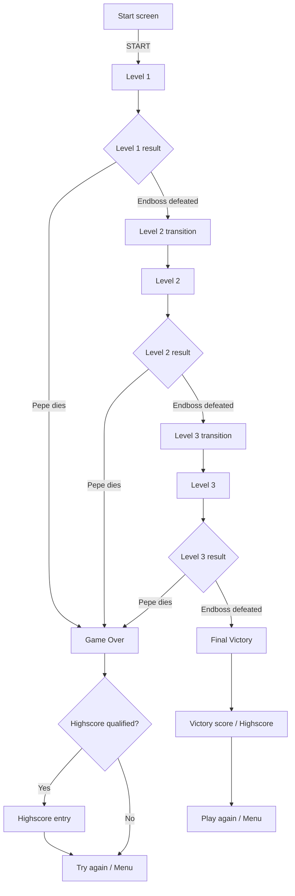

# El Pollo Loco

El Pollo Loco is a browser-based jump-and-run game built with Vanilla JavaScript, HTML, CSS, and the Canvas API.

The player controls Pepe through three increasingly demanding desert levels, collects coins and salsa bottles, defeats normal and small chickens, and fights an Endboss at the end of each level. The game supports desktop keyboard controls, responsive touch controls in mobile landscape mode, audio settings, pause/resume, Game Over, level transitions, Victory, and local highscore handling.

## Current gameplay flow

The current development branch contains a complete three-level progression flow.



Pepe's death has priority over boss completion. If Pepe and the Endboss die during the same combat sequence, the run always follows the Game Over path and cannot open the next-level dialog or Victory flow.

## Three-level configuration

All level-specific balancing values are centralized in `levels/level-config.js`.

| Value | Level 1 | Level 2 | Level 3 |
| --- | ---: | ---: | ---: |
| World width | 2000 px | 2720 px | 3440 px |
| Normal chickens | 7 | 10 | 13 |
| Small chickens | 5 | 8 | 11 |
| Ground bottles | 9 | 11 | 13 |
| New start bottles | 6 | 5 | 4 |
| Coins | 16 | 22 | 28 |
| Endboss energy | 300 | 400 | 500 |
| Endboss movement speed | 5.0 | 5.5 | 6.0 |
| Endboss charge cooldown | 7000 ms | 6000 ms | 5000 ms |
| Endboss hit cooldown | 400 ms | 350 ms | 300 ms |

Normal and small chicken movement speeds also increase through level-specific random speed ranges.

The background is extended dynamically to the configured end of the active level.

## Level creation

`levels/level1.js` is currently the shared level factory despite its historic filename.

For every configured level it creates:

- the configured number of normal chickens;
- the configured number of small chickens;
- one Endboss;
- the configured number of ground bottles;
- the configured number of coins;
- clouds;
- layered desert backgrounds.

Normal enemies are distributed across separate horizontal spawn slots. Enemy types are shuffled, while each slot receives a randomized position inside its own area. This avoids large accidental enemy clusters at level start.

## Level progression

Defeating the Endboss in Level 1 or Level 2:

1. stops active gameplay;
2. stores the remaining bottle inventory;
3. calculates the current level-end bonus;
4. freezes the finished World;
5. opens the next-level dialog;
6. creates a fresh World for the following level.

The accumulated score continues across levels.

Unused bottles are carried into the next level and are added to that level's configured new start bottles.

Example:

```text
remaining bottles from Level 1
+ Level 2 start bottles
= Level 2 starting inventory
```

There is no artificial global bottle cap.

## Bottle and coin HUD

Bottle and coin resources use custom twenty-segment HUD bars.

Each segment represents five percent of the active level resource range.

The exact numeric counts remain visible beside the bars.

### Bottle bar

The fixed maximum for the active level is calculated from:

```text
carried bottles
+ new start bottles
+ collectible ground bottles
```

### Coin bar

The coin bar is scaled against the configured number of coins in the current level.

Coin collection starts from zero again when a new World is created for the next level.

Health and Endboss energy still use the original image-based status bars.

## Player movement boundaries

Pepe may move across the complete playable world while remaining fully visible.

```text
left boundary  = 0
right boundary = levelEndX - Pepe.width
```

The camera is clamped to the playable level and no longer reveals technical background space beyond the configured world end.

## Chicken movement

Living chickens remain inside the current level until they are defeated or the level ends.

When a chicken reaches either level boundary:

- it turns around;
- it stays completely inside the level;
- it receives a new random movement speed from the current level configuration.

This applies to both normal and small chickens.

## Endboss movement and combat

The Endboss can also move across the complete playable level while remaining fully visible.

```text
left boundary  = 0
right boundary = levelEndX - Endboss.width
```

Normal body contact and the charge attack intentionally behave differently.

### Normal Endboss contact

Normal contact causes the established continuous contact damage while Pepe and the boss overlap.

It does not automatically knock Pepe away. This preserves the gameplay option to move through the boss and reach the other side of the arena.

### Charge attack

A successful charge:

- causes 100 damage;
- launches Pepe vertically;
- applies a horizontal boss knockback;
- marks the movement as boss-caused so it cannot be interpreted as a stomp attack.

Before Pepe is moved, the complete horizontal knockback target is calculated.

The preferred direction is away from the boss. If that target would leave the playable level, the opposite direction is selected before any movement occurs.

This prevents corner traps without producing a visible double knockback.

### Boss stomp protection

A boss-caused knockback cannot become an accidental stomp when Pepe falls back down.

A genuine player-initiated stomp from above still damages the Endboss.

## Ground bottle pickup collision

Ground bottles use a dedicated pickup collision test.

Pepe's configured collision offsets are used instead of the full 150-pixel sprite width, and both horizontal and vertical overlap are required.

This prevents bottles from being collected before Pepe visually reaches them.

Thrown-bottle projectile collision remains separate from pickup collision.

## Pause system

Active gameplay can be paused and resumed without rebuilding the World.

### Controls

| Input | Action |
| --- | --- |
| P | Pause / Resume |
| PAUSED - RESUME HUD button | Resume |

While paused:

- Pepe movement stops;
- gravity stops;
- chickens stop moving and animating;
- coin animation stops;
- clouds stop;
- thrown bottles stop;
- collision checks stop;
- Endboss movement and attacks stop;
- active game audio is paused at its current playback position;
- held gameplay input is cleared.

The render loop remains active so the pause indicator stays visible and clickable.

The visible pause button is positioned below the level indicator.

Pause is disabled once terminal Boss-defeat, Game Over, or Victory handling has started.

## Player controls

### Desktop

| Input | Action |
| --- | --- |
| Left Arrow | Move left |
| Right Arrow | Move right |
| Space | Jump |
| Shift | Throw salsa bottle |
| Up Arrow | Throw salsa bottle |
| P | Pause / Resume |
| Sound icon | Toggle mute |

The same pause instruction is shown in the Game Control menu and in the in-game control hints.

### Mobile landscape

The responsive touch controls use Pointer Events and support simultaneous input.

Left side:

- `LEFT`
- `JUMP`

Right side:

- `RIGHT`
- `THROW`

The mobile control state maps onto the same Keyboard flags used by desktop input.

Short transfer windows allow the player to slide between movement and action controls without immediately interrupting movement.

## Game Over flow

When Pepe reaches zero energy:

1. Pepe is immediately marked as defeated;
2. the death animation starts;
3. boss/level-completion paths are blocked;
4. the coffin sequence is shown;
5. the Game Over screen opens;
6. the current score is checked against the stored Top 10.

If the score qualifies, the existing highscore name dialog is opened.

If the score does not qualify, the normal Game Over actions remain available directly:

- **Try again**
- **Menu**

Restart is performed without `location.reload()`.

## Final Victory flow

Defeating the Level 3 Endboss starts the final Victory flow.

The current implementation:

- stops gameplay and audio;
- adds the current end-of-level bonus;
- evaluates the score for the local Top 10;
- opens the player-name dialog for a qualifying score;
- stores the entry in `localStorage`;
- displays the Victory result interface;
- offers Play again and Menu actions.

The highscore system currently stores a maximum of 10 entries. Expansion to the planned Top 100 system is still pending.

## Current scoring state

The game already awards score for combat, collectibles, throws, and level completion.

The final level-specific EP/score matrix has not yet been centralized. The current values are still distributed across the gameplay classes and will be replaced during the planned scoring refactor.

The current end-of-level bonus calculation is:

- remaining bottles × 3;
- collected coins × 15;
- remaining Character energy × 0.7, rounded.

These values are temporary and are scheduled to become level-specific.

## World architecture

`World` coordinates focused subsystems rather than owning every gameplay responsibility directly.

### WorldCollisionManager

Handles:

- Character versus Chicken and Little Chicken;
- Character versus Endboss;
- stomp detection;
- continuous enemy-contact damage;
- boss knockback resolution;
- bottle pickups;
- coin pickups;
- thrown-bottle hits;
- delayed removal of defeated normal enemies.

### WorldHudRenderer

Handles:

- health, bottle, coin, and boss status displays;
- twenty-segment bottle and coin bars;
- numeric resource values;
- score rendering;
- active level label;
- responsive game-control hints;
- sound icon;
- pause indicator and Resume hit area;
- responsive mobile HUD positioning.

### WorldRenderer

Handles the frame rendering path:

- background layers;
- clouds;
- collectibles;
- Pepe;
- enemies;
- thrown bottles;
- HUD;
- coffin;
- Victory and Game Over rendering;
- sprite mirroring;
- `requestAnimationFrame()` scheduling.

### WorldGameStateManager

Coordinates:

- Pepe-death priority;
- coffin sequence;
- Game Over;
- next-level versus final-Victory routing;
- restart;
- return to menu;
- current level-end bonus.

### WorldLevelManager

Coordinates:

- background extension;
- successful level completion;
- bottle carryover;
- level transition dialogs.

### WorldPauseManager

Coordinates:

- pause/resume state;
- held-key reset;
- active audio pausing;
- audio resume.

### WorldProcessManager

Coordinates:

- lifecycle cleanup;
- boss cleanup;
- input reset;
- audio shutdown;
- object freezing;
- canvas listener cleanup;
- start-screen restoration.

### WorldHighscoreManager

Coordinates:

- current Top-10 qualification;
- highscore data loading;
- newest-entry tracking;
- score blinking;
- Victory interaction;
- temporary highscore messages.

### WorldVictoryRenderer

Draws the final Victory result interface and stored score table.

## Audio management

`SoundHub` centralizes:

- background music;
- sound effects;
- mute state;
- persisted volume settings;
- gameplay interval registration;
- gameplay timeout registration;
- global audio cleanup;
- snoring audio;
- boss audio cleanup.

Mute and volume settings are stored in `localStorage`.

Pause temporarily pauses active playback without treating the game as muted.

## Responsive behavior

The internal game canvas keeps its fixed logical dimensions while CSS scales the visible stage proportionally.

The current responsive implementation includes:

- proportional 3:2 stage scaling;
- canvas pointer-coordinate conversion;
- landscape touch controls;
- portrait orientation overlay;
- responsive start menu;
- responsive settings, control, legal, and highscore overlays;
- adaptive HUD positioning;
- responsive score and control hints;
- adaptive sound-icon placement;
- touch controls that can move inside or outside the stage depending on available viewport space.

## Important source files

| File | Main responsibility |
| --- | --- |
| `index.html` | Static page structure, overlays, and script loading |
| `variables.css` | Shared color variables |
| `style.css` | Layout, responsive UI, overlays, and touch controls |
| `script.js` | Start/menu UI, settings, orientation, DOM overlays, and highscore UI |
| `soundhub.js` | Audio and shared gameplay-process management |
| `js/game.js` | Game initialization, level progression state, keyboard input, and mobile input |
| `levels/level-config.js` | Central three-level gameplay configuration |
| `levels/level1.js` | Shared configured level factory |
| `js/models-classes/world.class.js` | Main World orchestration |
| `js/models-classes/world-collision-manager.class.js` | Collision, pickups, projectile hits, and boss knockback |
| `js/models-classes/world-hud-renderer.class.js` | HUD, segmented resource bars, controls, sound, and pause UI |
| `js/models-classes/world-renderer.class.js` | Scene and terminal-state rendering |
| `js/models-classes/world-game-state-manager.class.js` | Game Over, level completion, Victory, restart, and menu flow |
| `js/models-classes/world-level-manager.class.js` | Background extension and level transitions |
| `js/models-classes/world-pause-manager.class.js` | Pause/resume and paused-audio state |
| `js/models-classes/world-process-manager.class.js` | Cleanup, shutdown, freezing, and menu reset |
| `js/models-classes/world-highscore-manager.class.js` | Highscore qualification and Victory interaction |
| `js/models-classes/world-victory-renderer.class.js` | Victory score table and actions |
| `js/models-classes/character.class.js` | Pepe movement, animation, death, and world boundaries |
| `js/models-classes/endboss.class.js` | Endboss movement, charge, damage, and death flow |
| `js/models-classes/chicken.class.js` | Normal chicken movement and boundary reversal |
| `js/models-classes/little-chicken.class.js` | Small chicken movement and boundary reversal |
| `js/models-classes/throwable-objects.class.js` | Ground and thrown salsa bottles |
| `js/models-classes/coin.class.js` | Coin behavior |

## Current development status

Completed or substantially completed:

- stable game lifecycle without page reload;
- responsive canvas and overlays;
- responsive mobile controls;
- architecture refactoring into dedicated World subsystems;
- three-level configuration;
- Level 1 → Level 2 → Level 3 transitions;
- different world widths and gameplay quantities per level;
- dynamic background extension;
- full playable world boundaries;
- randomized distributed chicken spawning;
- chicken boundary reversal with new random speed;
- bottle inventory carryover between levels;
- twenty-segment bottle and coin HUD bars;
- accurate ground-bottle pickup collision;
- Pepe-death priority over simultaneous boss completion;
- boss knockback protection against false stomps;
- full-edge Pepe and Endboss movement;
- safe pre-calculated Endboss charge knockback;
- gameplay pause/resume with keyboard and HUD control.

## Planned next development steps

The next major gameplay work starts with the remaining multi-level progression rules.

1. Finalize health and coin behavior across level transitions.
2. Centralize all level-specific EP/score values.
3. Add the Special Jump / Stomp Combo system.
4. Add the later chicken Scatter reaction.
5. Finish the full three-level Endboss balancing and bonus model.
6. Replace the current temporary end-of-level bonus with the final level-specific calculation.
7. Expand the highscore system from Top 10 to Top 100 and unify Game Over / Victory presentation.
8. Finalize three-level Game Over, restart, and Victory details.
9. Complete final HUD and responsive tests.
10. Enforce final code-quality requirements, including the Developer Akademie file-size and function-size rules.
11. Audit all user-facing text and code documentation for one consistent language.
12. Run final audio, cleanup, gameplay, and regression tests.
13. Complete final documentation and merge the feature branch.

## Developer Akademie compliance notes

The project is being prepared against the current Developer Akademie checklist.

Important final requirements include:

- no console errors;
- no unnecessary `console.log` output;
- functional buttons and links;
- local fonts and favicon;
- landscape-only mobile gameplay with portrait rotation notice;
- mobile touch controls only where appropriate;
- no small-screen scrollbars;
- descriptive and consistent filenames;
- single-responsibility functions;
- functions limited to approximately 14 commands;
- source files targeted at a maximum of 400 LOC;
- JSDoc documentation;
- no browser reload for restart;
- correct enemy hit detection and offsets;
- correct status-bar updates;
- no player movement after death;
- complete sound and mute cleanup;
- one consistent project language.

The project currently uses English as the target language for UI text and technical documentation. Remaining mixed-language content will be corrected during the final cleanup.
