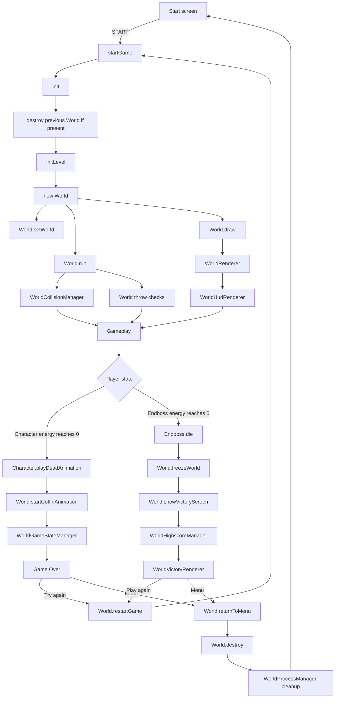

# El Pollo Loco

El Pollo Loco is a browser-based jump-and-run game built with Vanilla JavaScript, HTML, CSS, and the Canvas API.

The player controls Pepe through a scrolling desert level, collects coins and salsa bottles, defeats chickens, and finally fights the end boss. The game supports desktop keyboard controls and responsive touch controls for mobile landscape mode.

## Current gameplay flow

The current production version still contains one playable level. The architecture has been refactored so that rendering, collisions, lifecycle management, HUD logic, and highscore handling are separated from the main `World` coordinator.

## Game startup

The start button calls `startGame()` in `script.js`.

`startGame()`:

- resets the global score for a fresh run;
- resets the per-game highscore guard;
- hides the start screen;
- shows the game canvas;
- calls `init()`;
- enables mobile controls when applicable;
- starts background music;
- binds the global canvas sound handler.

`init()` in `js/game.js` creates a clean game instance:

1. Retrieves the canvas.
2. Calls `world.destroy()` if an older World still exists.
3. Calls `initLevel()`.
4. Creates a new `World(canvas, keyboard)`.
5. Stores the active instance in `window.world`.

This prevents an old World from continuing to run after restart or menu navigation.

## Level initialization

`initLevel()` in `levels/level1.js` builds the current level from:

- `Chicken` enemies;
- `LittleChicken` enemies;
- one `Endboss`;
- collectible salsa bottles;
- collectible coins;
- moving clouds;
- layered background objects.

The current repository still initializes `level1` only. The architecture is prepared for the planned multi-level extension, but the three-level gameplay itself is not implemented in this branch.

## World architecture

`World` is now primarily the coordinator between focused subsystems instead of containing all gameplay logic itself.

The main `World` responsibilities are:

| Function | Responsibility |
| --- | --- |
| `setWorld()` | Links the Character and enemies to the active World instance. |
| `run()` | Starts the recurring collision and throw checks. |
| `draw()` | Delegates frame rendering to `WorldRenderer`. |
| `checkThrowObjects()` | Creates thrown bottles and applies the throw cooldown. |
| `addScore()` | Updates the game score and displays temporary score feedback. |
| `updateBottleBar()` | Updates the bottle status bar. |
| `updateCoinBar()` | Updates the coin status bar. |
| `setManagedTimeout()` | Registers delayed World-owned callbacks. |
| `setManagedInterval()` | Registers recurring World-owned callbacks. |
| `destroy()` | Stops rendering, timers, listeners, overlays, and game processes. |

Public lifecycle methods such as `showVictoryScreen()`, `restartGame()`, `returnToMenu()`, `freezeWorld()`, and `stopAllGameProcesses()` remain available on `World` and delegate internally to the responsible manager.

## Extracted World subsystems

### WorldCollisionManager

`WorldCollisionManager` handles gameplay collisions and collectible interactions:

- Character versus Chicken and Little Chicken;
- Character versus Endboss;
- Character damage from living enemies;
- bottle pickups;
- coin pickups;
- thrown bottle hits on normal enemies;
- thrown bottle hits on the Endboss;
- removal of defeated enemies after the configured delay.

The existing gameplay scores and collision behavior are preserved.

### WorldHudRenderer

`WorldHudRenderer` owns the in-game HUD:

- health, bottle, coin, and boss status bars;
- collected bottle and coin values;
- score rendering;
- responsive score sizing;
- game-control hints;
- responsive mobile HUD layout;
- sound icon rendering;
- sound icon hit area and mute interaction.

`World.getMobileHudLayout()` and `World.handleSoundIconClick()` remain compatibility delegates because they are used outside the renderer.

### WorldRenderer

`WorldRenderer` owns the main frame rendering path:

- background layers;
- clouds;
- collectibles;
- Pepe;
- enemies;
- thrown bottles;
- HUD composition;
- coffin rendering;
- Victory background;
- Game Over background and buttons;
- sprite mirroring;
- scheduling the next animation frame.

`World.draw()` now delegates to this renderer.

### WorldGameStateManager

`WorldGameStateManager` coordinates terminal gameplay flow:

- coffin sequence;
- Game Over screen;
- Victory flow;
- restart;
- return to menu;
- transition from Character or Endboss terminal states into the appropriate result flow.

### WorldProcessManager

`WorldProcessManager` owns cleanup and shutdown operations:

- boss-specific cleanup;
- keyboard and touch-state reset;
- menu UI restoration;
- canvas sound-handler detachment;
- stopping music and effects;
- stopping remaining document audio;
- freezing Character, enemies, clouds, and background objects;
- stopping globally registered gameplay processes.

### WorldHighscoreManager

`WorldHighscoreManager` handles highscore-related flow:

- current Top-10 qualification;
- loading stored highscore data;
- reading the newest stored entry;
- temporary qualification messages;
- score blinking during the result flow;
- Victory option interaction;
- Victory click handling.

The current implementation still stores a maximum of 10 entries in `localStorage`.

### WorldVictoryRenderer

`WorldVictoryRenderer` draws the current Victory result UI:

- highscore result window;
- column headers;
- stored score rows;
- highlighting and blinking of the newest entry;
- Menu button;
- Play again button.

The renderer reads highscore data through `WorldHighscoreManager`.

## Rendering and gameplay processes

### Rendering

`World.draw()` delegates to `WorldRenderer.draw()`.

The renderer separates each frame into:

1. background and cloud layer;
2. HUD layer;
3. gameplay object layer;
4. terminal overlays;
5. sound icon;
6. next `requestAnimationFrame()`.

The active animation-frame ID is stored on `World` and cancelled by `World.destroy()`.

### Gameplay checks

`World.run()` starts a registered interval that repeatedly calls:

- `WorldCollisionManager.checkCollisions()`;
- `World.checkThrowObjects()`.

Gameplay intervals are registered through `SoundHub` so they can be stopped centrally when gameplay ends.

World-specific delayed and recurring actions use:

- `setManagedTimeout()`;
- `setManagedInterval()`;
- `clearManagedTimeouts()`;
- `clearManagedIntervals()`.

This prevents callbacks from a discarded game instance from continuing after Restart or Return to Menu.

## Player controls

### Desktop

| Input | Action |
| --- | --- |
| Left Arrow | Move left |
| Right Arrow | Move right |
| Space | Jump |
| Shift | Throw salsa bottle |
| Up Arrow | Throw salsa bottle |
| Sound icon | Toggle mute |

Keyboard state is stored in a `Keyboard` instance and read by the Character and World.

### Mobile landscape

The responsive touch controls use Pointer Events and support simultaneous input.

Left side:

- `LEFT`
- `JUMP`

Right side:

- `RIGHT`
- `THROW`

The mobile control state is mapped onto the same Keyboard flags used by desktop input.

Short transfer windows make it possible to slide between movement and action buttons without immediately interrupting movement.

## Character control

The `Character` class handles Pepe's movement and animation states.

Important behavior:

- `animate()` reads the active keyboard state and controls movement, jumping, idle states, hurt animation, and death detection;
- `applyGravity()` controls vertical movement;
- `playThrowAnimation()` plays the throw sequence;
- `playDeadAnimation()` plays the death sequence and schedules the coffin transition;
- `snapToGround()` stabilizes Pepe after vertical movement.

If Pepe's energy reaches zero, the Character starts the death animation and transfers control to the Game Over flow through `World.startCoffinAnimation()`.

## Collision and scoring flow

Collision handling is delegated to `WorldCollisionManager`.

Examples:

- jumping onto a normal chicken defeats it;
- touching a living enemy damages Pepe;
- collecting bottles increases bottle inventory;
- collecting coins increases the coin counter;
- thrown bottles can defeat chickens;
- thrown bottles damage the Endboss;
- jumping onto the Endboss damages it and bounces Pepe away.

The World remains the owner of score values and status bars, while the collision manager invokes the corresponding World methods when gameplay events occur.

## Game Over flow

The Game Over path currently follows this sequence:

1. Pepe reaches zero energy.
2. `Character.playDeadAnimation()` starts.
3. `World.startCoffinAnimation()` delegates to `WorldGameStateManager`.
4. The coffin animation completes.
5. The Game Over screen is shown.
6. The player chooses:
   - **Try again** → `restartGame()`;
   - **Menu** → `returnToMenu()`.

`restartGame()` starts a fresh World without using `location.reload()`.

The global and World score are reset before the next game starts.

## Victory flow

The current Victory path starts when the Endboss has no remaining energy.

1. `Endboss.die()` stops boss activity and plays the death animation.
2. The World is frozen.
3. 150 points are added for defeating the boss.
4. `World.showVictoryScreen()` delegates to `WorldGameStateManager`.
5. The current Victory bonus is calculated.
6. `WorldHighscoreManager` evaluates the score.
7. A qualifying score opens the player-name dialog.
8. The saved entry is persisted in `localStorage`.
9. `WorldVictoryRenderer` displays the result table and Victory actions.
10. The player chooses:
    - **Play again** → `restartGame()`;
    - **Menu** → `returnToMenu()`.

## Current Victory bonus

The current single-level Victory bonus is calculated from remaining resources:

- collected bottles × 3;
- collected coins × 15;
- remaining Character energy × 0.7, rounded.

These values describe the current one-level version only and will be replaced by level-specific values during the planned three-level implementation.

## Highscore flow

The current highscore data is stored in browser `localStorage`.

Important functions and owners:

| Function | Owner | Responsibility |
| --- | --- | --- |
| `saveHighScoreEntry()` | `WorldHighscoreManager` | Checks whether the score qualifies for the current Top 10. |
| `openHighscoreNameDialog()` | `script.js` | Opens the responsive player-name dialog. |
| `submitHighscoreName()` | `script.js` | Validates the player name and prevents repeated submission. |
| `storeHighscore()` | `script.js` | Sorts and stores the highscore list. |
| `showHighscoreSavedOverlay()` | `script.js` | Shows the save confirmation dialog. |
| `drawVictoryOptions()` | `WorldVictoryRenderer` | Draws the Victory result table and buttons. |

The current implementation prevents the same highscore dialog from being handled more than once during one game session.

The most recently stored entry can be highlighted in the highscore display.

## Game lifecycle cleanup

A major design requirement is that Restart and Return to Menu work without a browser reload.

`World.destroy()` performs the World-level cleanup:

- sets `isRunning = false`;
- stops globally registered gameplay processes;
- clears World-managed timeouts;
- clears World-managed intervals;
- removes temporary highscore messages;
- cancels the active `requestAnimationFrame`;
- removes Game Over and Victory canvas listeners;
- disables score blinking;
- detaches Victory click handling.

`WorldProcessManager` handles the supporting cleanup:

- stops boss-specific processes;
- stops music and effects;
- stops remaining audio elements;
- resets keyboard state;
- resets mobile touch state;
- removes gameplay-only mobile-control classes;
- removes the global canvas sound handler;
- freezes active moving objects when required;
- restores the start-screen UI;
- clears `window.world`.

This keeps discarded game instances from leaving active timers, listeners, audio, or input state behind.

## Audio management

`SoundHub` centralizes:

- background music;
- sound effects;
- mute state;
- persisted volume settings;
- gameplay interval registration;
- gameplay timeout registration;
- global audio cleanup;
- snoring audio;
- boss audio cleanup.

The mute and volume settings are stored in `localStorage`.

The sound icon uses the same central audio state on desktop and mobile layouts.

## Shared color system

Application colors are centralized in `variables.css` as CSS Custom Properties on `:root`.

CSS uses these values through `var(--color-...)`.

Canvas and JavaScript-rendered UI resolve the same variables through `getGameColor()`, so CSS and Canvas share one color source instead of duplicating hexadecimal, RGB, or named color values throughout the codebase.

## Responsive behavior

The internal game canvas remains at its fixed logical game size while CSS scales the visible stage proportionally.

The responsive implementation includes:

- proportional 3:2 stage scaling;
- canvas pointer-coordinate conversion through `getCanvasCoordinates()`;
- landscape touch controls;
- portrait rotation overlay;
- responsive start menu;
- responsive settings and highscore overlays;
- Highscore name and confirmation dialogs sized relative to the viewport;
- adaptive status-bar positioning;
- responsive Score and control hints;
- adaptive sound-icon placement;
- touch controls that move inside or outside the game stage depending on viewport dimensions.

## Important source files

| File | Main responsibility |
| --- | --- |
| `index.html` | Static page structure, overlays, and script loading |
| `variables.css` | Shared color variables |
| `style.css` | Layout, responsive UI, overlays, and touch controls |
| `script.js` | Menu UI, start flow, settings, orientation, and DOM highscore UI |
| `js/game.js` | Game initialization, keyboard input, and mobile input |
| `js/models-classes/world.class.js` | Main World orchestration and public gameplay interface |
| `js/models-classes/world-collision-manager.class.js` | Collision and collectible handling |
| `js/models-classes/world-hud-renderer.class.js` | HUD layout, score, controls, and sound icon |
| `js/models-classes/world-renderer.class.js` | Scene rendering and terminal overlay rendering |
| `js/models-classes/world-game-state-manager.class.js` | Game Over, Victory, restart, and menu flow |
| `js/models-classes/world-process-manager.class.js` | Cleanup, audio shutdown, freezing, and menu reset |
| `js/models-classes/world-highscore-manager.class.js` | Highscore qualification and Victory interaction flow |
| `js/models-classes/world-victory-renderer.class.js` | Victory highscore table and action rendering |
| `js/models-classes/character.class.js` | Pepe movement and animation |
| `js/models-classes/endboss.class.js` | Endboss behavior, attacks, damage, and death flow |
| `js/models-classes/chicken.class.js` | Normal chicken enemy |
| `js/models-classes/little-chicken.class.js` | Small chicken enemy |
| `js/models-classes/throwable-objects.class.js` | Collectible and thrown salsa bottles |
| `js/models-classes/coin.class.js` | Collectible coin behavior |
| `soundhub.js` | Audio and shared gameplay-process management |
| `levels/level1.js` | Current level composition |

## Current project status

The current version includes:

- one playable level;
- responsive desktop and mobile-landscape gameplay;
- keyboard and multi-touch controls;
- responsive menu and overlay system;
- audio controls with persistent mute and volume settings;
- Game Over and Victory flows;
- restart without page reload;
- clean Return-to-Menu lifecycle;
- local Top-10 highscore storage;
- duplicate highscore-submit protection;
- clean score reset for a fresh game;
- responsive highscore dialogs;
- centralized game colors;
- separated collision, HUD, rendering, highscore, terminal-state, and cleanup responsibilities;
- controlled timer, interval, listener, audio, and RAF cleanup.

The architecture branch prepares the existing game for the planned three-level implementation. The level expansion itself, including level-specific balancing, score progression, carryover rules, transition dialogs, and the expanded highscore concept, is intentionally not part of the current implementation.
